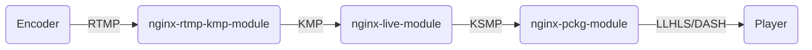
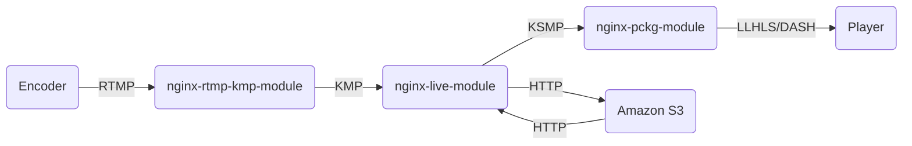
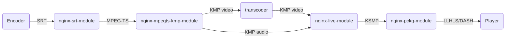
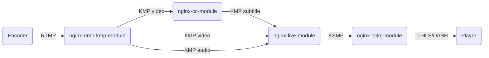
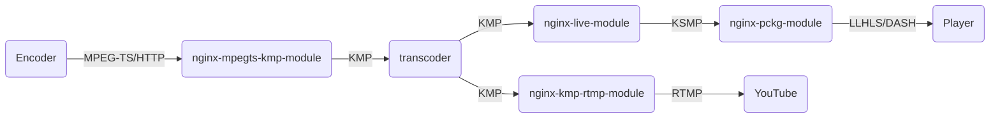

# Kaltura Media Framework

A distributed framework for live video streaming. The system is composed of multiple components, each one responsible for a specific function.

The components can be deployed on a single server for small scale deployments/testing, but it is recommended to deploy them separately
for a more optimal resource utilization. For example, the transcoder can utilize the GPU, so it would be more cost efficient to deploy the
transcoders on GPU-enabled servers, while the other components would run on servers without GPU.

Media is transmitted between the different components internally using custom protocols -
1. [Kaltura Media Protocol (KMP)](#kaltura-media-protocol-kmp) - a TCP-based protocol for delivering streaming media, conceptually, similar to a single track of fMP4/MPEG-TS
2. [Kaltura Segmented Media Protocol (KSMP)](#kaltura-segmented-media-protocol-ksmp) - an HTTP-based protocol for delivering media in segments, conceptually, a super-set of LLHLS/DASH

The orchestration of the different media components is performed by a "controller". The main responsibility of the controller is building
the topology of the media pipeline, and updating it in case of failures. The controller gets JSON events from the media components sent
as HTTP-POSTs. In addition, all the media processing components expose a [JSON-based REST API](#api-overview), that is used by the controller to get
the latest status and take actions. A sample controller implementation for an all-in-one server is provided in the [conf](conf/) folder.

## Main Features

- Publishing protocols: RTMP, MPEGTS (over SRT/HTTP/TCP)
- Playback protocols: HLS/LLHLS, DASH
- Live push/relay protocols: RTMP
- Video/audio transcoding - including GPU support, based on ffmpeg API
- Persistence - in S3 (or compatible) object storage
- Adaptive bitrate delivery
- Subtitle support - including conversion of 608/708 to WebVTT
- Alternative audio
- Media encryption and DRM
- Video frame capture

## Getting Started

The [conf](conf/) folder contains sample code and configuration for running an all-in-one server.

## Glossary

- *Channel* - a container that represents a live stream, may contain tracks, variants, timelines etc.
- *Track* - a single rendition of video/audio/subtitle. For example, a channel may have 3 video tracks: 1080p, 720p, 540p.
- *Variant* - a grouping of tracks used for packaging. Variants determine which audio track will be paired to each video track, when muxed segments are used.
    A variant can point to multiple tracks, but no more than one track per media type.
    Tracks must be associated to variants in order to be delivered via HLS/DASH.
- *Segment* - a group of frames of a specific track. Segments are always independent - video segments will always start with a key/IDR frame.
- *Segment index* - a number that identifies the segments of the different tracks that are associated with a specific time interval.
- *Period* - a set of segment indexes that can be played continuously.
- *Timeline* - a set of periods. Multiple timelines can be created, each with its own set of periods.
    Timelines can be used, for example, in order to implement "preview mode" - the publisher consumes one timeline, while the viewers consume another.
    The timeline of the publisher is always `active`, while the timeline of the viewers is activated upon the publisher's discretion.

## Sample Topologies

The diagrams below demonstrate a few sample topologies that can be created using the Media-Framework components.

### Simple RTMP Passthrough

### Passthrough + S3 Persistence

### SRT Input + Video Transcoding

### Closed-captions Decoding

### Transcoding + RTMP Push

## Components Overview

### Media Components

- [nginx-rtmp-kmp-module](nginx-rtmp-kmp-module/) - live media ingestion, input: *RTMP*, output: *KMP x N*

- [nginx-mpegts-kmp-module](nginx-mpegts-kmp-module/) - live media ingestion, input: *MPEG-TS over TCP/HTTP*, output: *KMP x N*

- [transcoder](transcoder/) - video/audio transcoding, input: *KMP*, output: *KMP x N*

- [nginx-live-module](nginx-live-module/) - live media segmenter, input: *KMP x N*, output: *KSMP*

    *Additional features*: persistence, filler, timeline support.

- [nginx-pckg-module](nginx-pckg-module/) - live media packager (stateless), input: *KSMP*, output: *HLS/LLHLS, DASH*

    *Additional features*: adaptive bitrate, subtitles, alternative audio, media encryption / DRM, video frame capture

- [nginx-kmp-cc-module](nginx-kmp-cc-module/) - closed-captions decoder, input: *KMP video (h264/5)*, output: *KMP subtitle (WebVTT) x N*

- [nginx-kmp-rtmp-module](nginx-kmp-rtmp-module/) - live media relay, input: *KMP x N*, output: *RTMP*

**Important**: All stateful nginx-based components (=all except nginx-pckg-module), must be deployed on a single process nginx server (`worker_processes 1;`).
    The module state is kept per process, and when multiple processes are used, it is not possible to control which process will get the request.
    For example, the request to create a channel on the segmenter may arrive to worker 1, while the KMP connection with the actual media, will hit worker 2.
    In deployments that use containers, this shouldn't be a problem - multiple containers can be deployed on a single server, instead of using multiple nginx processes.
    Another possibility is to use a patch like arut's [per-worker listener](https://github.com/arut/nginx-patches/blob/master/per-worker-listener),
    but it will probably need to be updated to apply to `stream` connections as well.

### Dependencies

The following modules are dependencies for building the media components listed above.
When compiling nginx, the dependencies must be added (`--add-module`) before any module that requires them.

- [nginx-common](nginx-common/) - shared code for: exposing an HTTP API, sending HTTP events, parsing JSON, KMP/KSMP definitions, etc.,
    used by: most nginx modules.

- [nginx-kmp-in-module](nginx-kmp-in-module/) - a utility module for receiving KMP input, used by: nginx-live-module, nginx-kmp-cc-module, nginx-kmp-rtmp-module.

- [nginx-kmp-out-module](nginx-kmp-out-module/) - a utility module for sending KMP output, used by nginx-rtmp-kmp-module, nginx-mpegts-kmp-module, nginx-kmp-cc-module.

- [nginx-rtmp-module](nginx-rtmp-module/) - a modified version of [nginx-rtmp-module](https://github.com/arut/nginx-rtmp-module), used by: nginx-rtmp-kmp-module.
    - Support for multiple RTMP streams on a single connection
    - Support for additional encoders (automatic detection of ext-timestamp in type-3 packets, generation of onFCPublish messages)
    - Detection of embedded captions
    - Removed features: hls/dash output, notifications, relay, auto push, rtmp playback etc.

- [nginx-mpegts-module](nginx-mpegts-module/) - a modified version of [nginx-ts-module](https://github.com/arut/nginx-ts-module), used by: nginx-mpegts-kmp-module.
    - Support for additional codecs: h265, AC3, E-AC3, OPUS
    - Removed features: hls/dash output

### Debug Options

Some of the Media-Framework components support optional preprocessor macros for debugging purposes -
- *NGX_LBA_SKIP* (nginx-common) - Skips the use of the "Large Buffer Array" (LBA) module. When enabled, LBA allocations are routed to ngx_alloc / ngx_free.
- *NGX_RTMP_VERBOSE* (nginx-rtmp-module) - Enables additional debug log messages
- *NGX_LIVE_VALIDATIONS* (nginx-live-module) - Enables runtime consistency checks on internal data structures, enabled by default when using `--with-debug`
- *NGX_BLOCK_POOL_SKIP* (nginx-live-module) - Skips the use of block pools. When enabled, block pool allocations are routed to ngx_palloc / ngx_pfree.

To test the modules with valgrind, it is recommended to the apply the [no-pool-nginx](https://github.com/openresty/no-pool-nginx) patch,
and configure nginx with `--with-cc-opt="-O0 -DNGX_BLOCK_POOL_SKIP -DNGX_LBA_SKIP"` and `--with-debug`.

## Kaltura Media Protocol (KMP)

Kaltura Media Protocol is a simple packet-based protocol for streaming media over TCP.
A KMP connection can deliver the media of a single video/audio/subtitle track - when multiple tracks are needed, multiple TCP connections are established.

Each packet starts with a header that contains the following fields (32 bits each) -
- *Type* - the type of the packet. The packet types are four-character codes, see below the list of currently defined types.
- *Header size* - the size of the packet header, must be between sizeof(kmp_packet_header_t) and 64KB.
    Parsers must use the header size in order to access the data of the packet, this enables the addition of new fields to packet headers without breaking existing parsers.
- *Data size* - the size of the packet data, must be between 0 and 16MB.
- *Reserved* - reserved for future use, must be set to 0.

The structures and constants used in KMP can be found in [ngx_live_kmp.h](nginx-common/src/ngx_live_kmp.h).

### KMP Frame Ids

A frame id is a 64-bit integer that uniquely identifies an input frame.
The ingest modules (*nginx-rtmp-kmp-module* / *nginx-mpegts-kmp-module*) allocate the initial frame id according to the server clock (in timescale units),
when an output track is created.
In order to avoid the need to send the frame id on each frame that is being sent, the frame ids in KMP are sequential -
the id of the N-th frame that is sent on a KMP connection is `initial_frame_id + N`.

If the input connection (e.g. RTMP) drops and gets re-established, new KMP frame ids will be allocated.
Since the default timescale is high (90kHz), and the frame rate is unlikely to exceed 60fps, even in case of a reconnect after a short period of streaming,
the initial frame id will be significantly higher than the frame id that was last sent on the previous connection.
So, it is extremely unlikely to have a conflict with any previously used frame ids due to reconnect.

Frame ids are used:
- To identify which frames are being acked in KMP ack packets
- To skip previously handled frames if a KMP connection is re-established

The transcoder adds a few complexities to the management of frame ids -
- Since the transcoder may change the input frame rate or drop frames, the frame ids in the transcoder input,
    are not necessarily the same as the frame ids in the transcoder output.
    If the transcoder is restarted, it needs to know what value to send as the `initial_frame_id` of its upstream server (usually nginx-live-module).
    The `upstream_frame_id` field is used for this purpose.
- The transcoder may be configured to change the sampling rate of an audio track, and, in this case, the transcoded frames do not align with the input frames.
    To handle this scenario, the transcoder needs to have the ability to acknowledge only a part of an input frame.
    This is the purpose of the `offset` field - it can store, for example, the number of audio samples that should be acknowledged within the frame.
    The exact meaning of the `offset` field is determined by the KMP receiver -
    the receiver sets the `offset` in the ack frames it returns, and gets it back in the `initial_offset` field of the connect packet, in case of reconnect.

### Publisher KMP Packets

The sections below list the KMP packets that can be sent by a KMP publisher.

#### Connect (`cnct`)

Sent immediately after the KMP TCP connection is established.

The header contains the following fields:
- `channel_id` - string, the channel id that is being published. The maximum allowed length is 32 chars.
- `track_id` - string, the track id that is being published. The maximum allowed length is 32 chars.
- `initial_frame_id` - integer, the id of the first frame being sent.
- `initial_upstream_frame_id` - integer, the initial frame id that should be sent to the upstream server (used by the transcoder)
- `initial_offset` - integer, the offset to start from, within the initial frame.
- `flags` - integer, a bit mask of flags, currently a single flag is defined -
    `consistent` - this flag is set when the KMP publisher generates consistent (bit exact) output, given the same input.
        *nginx-rtmp-kmp-module* and *nginx-mpegts-kmp-module* are examples of publishers that are consistent.
        The *transcoder*, on the other hand, is not. The `consistent` flag is used by the LL segmenter in case of reconnect.
        When the publisher is consistent, the LL segmenter can continue from the point it left off.
        When the publisher is inconsistent, the LL segmenter can continue only from the next GOP -
        it must not mix a partial GOP from before the disconnect, with the GOP received after the disconnect.

The data of the connect packet is optional, the expected format of the data is defined by the specific KMP receiver.

#### Media Info (`minf`)

Contains the parameters of the media.
Some of the fields in the header are shared by all media types, while the rest are defined only for a specific type (union).

The shared header fields are:
- `media_type` - integer, the type of media - `video` / `audio` / `subtitle`, uses the KMP_MEDIA_XXX constants.
- `codec_id` - integer, the codec id, uses the KMP_CODEC_XXX constants.
- `timescale` - integer, the units used in the `dts` / `pts_delay` / `created` fields of frame packets, in Hz.
- `bitrate` - integer, the bitrate, in bits per second.

The video-specific header fields are:
- `width` - integer, the width of the video, in pixels.
- `height` - integer, the height of the video, in pixels.
- `frame_rate` - rational, the frame rate of the video, in frames per second.
- `cea_captions` - boolean, set to `1` when the video track contains EIA-608 / CTA-708 captions.

The audio-specific header fields are:
- `channels` - integer, the number of audio channels.
- `bits_per_sample` - integer, the size of the audio samples, in bits.
- `sample_rate` - integer, the sampling rate of the audio, in samples per second.
- `channel_layout` - integer, a bit mask of channel positions, uses the KMP_CH_XXX constants.

The data of the media info packet holds the codec private/extra data.
For example, when using the `h264` codec, the data contains the body of an `avcC` MP4 box.

KMP receivers should handle media info changes, for example, a change to the video resolution.
However, the type of the media (video/audio/subtitle) that is sent in a KMP connection, must not change.

KMP receivers should ignore media info packets, when they are identical to the previously received media info packet.

#### Frame (`fram`)

Represents a single video frame / audio frame / subtitle cue.

The frame header contains the following fields:
- `created` - integer, the time in which the frame was received by the first Media-Framework module in the pipeline, in timescale units.
- `dts` - integer, the decode timestamp of the frame, in timescale units.
- `flags` - integer, currently only one flag is defined -
    `key` - enabled on video keyframes.
- `pts_delay` - integer, the difference between the presentation timestamp of the frame, and the decode timestamp, in timescale units.

When the media type is video / audio, the data of the frame packet holds the compressed media.
When the media type is subtitle and the codec is WebVTT, the data of the frame follows the WebVTT Sample Format, as specified in `ISO/IEC 14496-30`
(usually, in this case, a sample is a `vttc` box, that contains a `payl` box).

#### Null (`null`)

Sent in order to signal "liveness", and prevent idle timers from expiring.
Null packets do not carry any data other than the basic KMP header.
Parsers must ignore null packets.

#### End Of Stream (`eost`)

Used to signal a graceful termination of the publishing session.
End of stream packets do not carry any data other than the basic KMP header.

### Receiver KMP Packets

The sections below list the KMP packets that can be sent by a KMP receiver.

#### Ack Frames (`ackf`)

Acknowledge the receipt of frames.

The KMP receiver decides on the appropriate time to send an ack packet.
For example, when persistence is enabled, the segmenter sends an ack only after a segment that contains the frame is saved to storage.

Some receivers do not send acks at all, in this case, the KMP producer must be configured to discard the frames after they are sent (using the `resume_from` setting)

The packet header contains the following fields:
- `frame_id` - integer, the id of the first frame that should be re-sent if the connection is dropped.
    In other words, an ack frames packet, acknowledges all frames that have an id that is less `frame_id`.
    If the KMP connection is re-established, this value will be sent in the `initial_frame_id` field.
- `upstream_frame_id` - integer, the id of the frame that was sent to the upstream server.
    If the KMP connection is re-established, this value will be sent in the `initial_upstream_frame_id` field.
- `offset` - integer, the offset to acknowledge within the frame.
    If the KMP connection is re-established, this value will be sent in the `initial_offset` field.
- `padding` - integer, reserved for future use, must be set to zero.

The data of the ack packets is not used.

## Kaltura Segmented Media Protocol (KSMP)

Kaltura Segmented Media Protocol is an HTTP-based protocol for delivering media in segments, similarly to HLS/DASH.

A KSMP request is an HTTP GET request, the following query parameters are defined -
- `channel_id` - required string, the id of the channel
- `timeline_id` - required string, the id of the timeline
- `flags` - required hex integer, the flags:
    - Select the subset of data that is required (like the column list in an SQL SELECT statement)
    - Control various behaviors when servicing the request.
        For example, the 'closest key' flag, returns only the key frame that is closest to the request timestamp, instead of returning the whole segment.
- `variant_ids` - optional string, selects a subset of the variants that should be returned, by default, all variants are returned.
    If multiple variants are specified, they should be delimited with an hyphen (-).
- `media_type_mask` - optional hex integer, sets the media types that should be returned, by default, all media types are returned.
- `time` - optional integer, the requested timestamp. The timestamp is used, for example, in order to capture a video frame at a specific time.
- `segment_index` - optional integer, the index of the segment
- `max_segment_index` - optional integer, used to limit the scope of segments returned in the response. This parameter can be used to replay a persisted stream for debugging.
- `part_index` - optional integer, the zero based index of the partial segment within the segment. A request that uses `part_index` must send also `segment_index`.
- `skip_boundary_percent` - optional integer, sets the *skip boundary* value as a percent of the *target duration*
    (see the definition of the `CAN-SKIP-UNTIL` attribute in the HLS specification for more details)
- `padding` - optional integer, adds additional zero bytes at the end of the response. Used to comply with ffmpeg's padding requirements without incurring additional copy operations.

A KSMP response uses KLPF format (see below), with type *Serve* (`serv`).
The KSMP-specific definitions can be found in [ngx_ksmp.h](nginx-common/src/ngx_ksmp.h)

## Kaltura Live Persist File (KLPF)

Kaltura Live Persist File is a serialization scheme that is used in KSMP responses and in the S3 objects created by nginx-live-module.

A KLPF is composed of blocks, similar to MP4 atoms/boxes. Each block has the following header -
- `id` - a four-character code identifying the block
- `size` - uint32, the full size of the block (header & data)
- `flags` - 4 bits, the following flags are defined:
   - *container* (0x1) - the block contains other blocks
   - *index* (0x2) - the block is an index to another block, header size should not be used
   - *compressed* (0x4) - the data of the block is zlib-compressed
- `header_size` - 28 bits, the size of the block header. Parsers must use the header size in order to access the data of the block,
    so that fields could be added to the header without breaking compatibility

A KLPF file is a block whose id is set to `klpf`.
Following the generic block header fields (listed above), a KLPF file has the following fields in its header -
- `uncomp_size` - uint32, holds the uncompressed size of the data, when the KLPF data is compressed
- `version` - uint32, the version of the file format. The version used for new files is updated on every breaking change to the format, the code will be updated to either
   - support reading both the new format and the old format, or
   - ignore files that use the old format
- `type` - a four-character code that identifies the type of data stored in the KLPF. The type determines which block ids are supported, and their internal structure.
    The type `serv` (*Serve*) is used for KSMP responses, in the communication between the packager and the segmenter. Additional types are used internally by the segmenter.
- `created` - uint64, the unix timestamp when the KLPF was created

For more details on the internal structure of KLPF blocks, see [KLFP-SPEC.md](nginx-common/KLFP-SPEC.md).

To inspect the contents of KLPF objects/KSMP responses, use [klpf_parse.py](nginx-common/scripts/klpf_parse.py).
The script can show the block structure without any additional info, however, in order to parse the fields inside the blocks:
- run [generate_persist_spec.py](nginx-live-module/scripts/generate_persist_spec.py), and save the output to a file
- provide the file name to klpf_parse.py using the `-s / --spec-file` option

## API Overview

All the media processing components expose a JSON-based REST API.
This section explains the general properties of the Media-Framework APIs.
For a detailed reference of the available API endpoints, see the documentation of the specific modules.

### Request Types

The following HTTP verbs are used in the API:
- `GET` - get the full status of the module, or a subset of it. The argument `?pretty=1` can be added to the request, in order to return the response in a "pretty" / indented format.
- `GET` with `?list=1` - return the names of the "folders" under a certain path in the API. Can be used to walk the tree of possible API routes.
- `POST` - create an object.
- `PUT` - update an object, the id of the object to update is passed on the URI.
- `DELETE` - delete an object, the id of the object to delete is passed on the URI.

The request body in `POST` / `PUT` requests must be a JSON (usually an object), and the request must use the header `Content-Type: application/json`.

When the size of the request body exceeds a certain threshold, nginx writes it to a temporary file.
However, the implementation of the Media-Framework API requires that the request body of `POST` / `PUT` requests will be available in memory.
If needed, the nginx `client_body_buffer_size` directive can be used to increase the size of the buffer allocated for the request body.

### Status Codes

HTTP status codes are used to return the execution status of API requests.

The following success codes are used:
- `200` - a successful `GET` request, the response body is a JSON, usually a JSON object or array (the response includes the header `Content-Type: application/json`).
- `201` - a successful `POST` request, that resulted in the creation of a new object.
- `204` - a successful `POST` / `PUT` / `DELETE` request.
    A `POST` request may return `204` when the object already existed, and `upsert` is enabled on the API location in nginx configuration.

The following error codes are used:
- `400` - invalid request, for example, the length of some input field exceeds the limit.
- `403` - returned by nginx-live-module when getting a request to update a channel that is currently being read from storage.
- `404` - some object referenced by the URI or request body was not found.
- `409` - attempt to create an object that already exists, when `upsert` is not enabled on the API location in nginx configuration.
- `415` - the request body is not a valid JSON, the type of the JSON is not expected (usually a JSON object is expected), or some required field is missing.
- `500` - an unexpected error, for example, a memory allocation failure.

### Multi Request

Setting up a channel in nginx-live-module may require multiple API calls - create the channel, create a timeline, create a variant, etc.
In order to avoid the penalty of multiple round trips, the API layer has support for "multi" requests.
A multi request bundles together several API requests in a single HTTP request.

Multi requests must use the `POST` verb, and their URI must be set to `/multi`.
The request body must be a JSON array of objects, each object represents a single API request.

The objects contains the following fields:
- `uri` - string, required, the relative API path.
- `method` - string, required, the HTTP verb of the request - `GET` / `POST` / `PUT` / `DELETE`.
- `body` - any (usually object), optional, the body of `POST` / `PUT` requests.

The response of multi requests is also a JSON array of objects.
The number of elements in the response array always matches the number of elements in the request array,
and the order of the objects in the response array matches the order in the request array.
In other words, the N-th item of the response array, is the response of the N-th request in the request array.

Each response object contains the following fields:
- `code` - integer, required, the HTTP status code
- `body` - any (usually object / array), optional, the response body

## Copyright & License

All code in this project is released under the [AGPLv3 license](http://www.gnu.org/licenses/agpl-3.0.html) unless a different license for a particular library is specified in the applicable library path.

Copyright © Kaltura Inc. All rights reserved.
